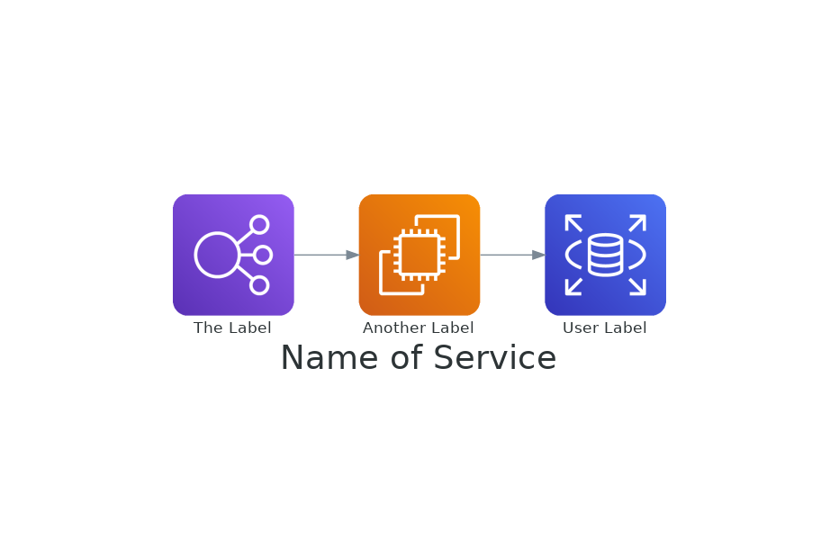
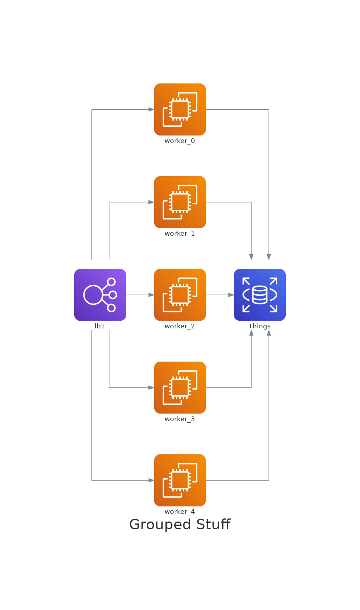
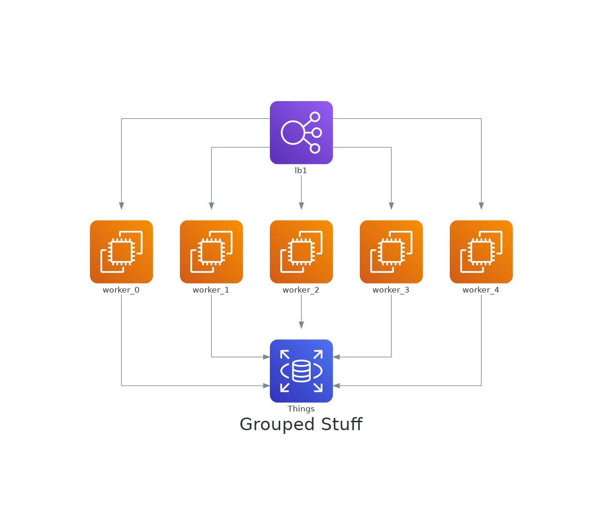
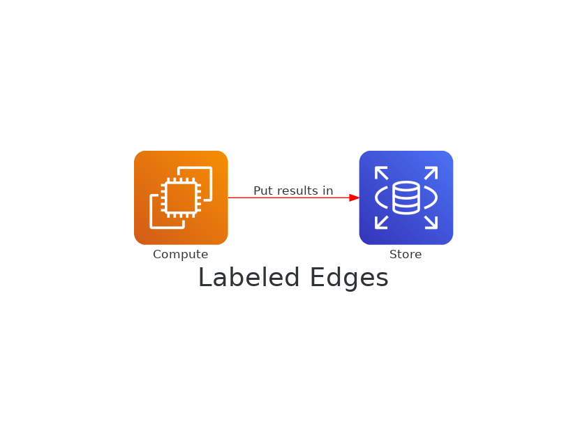
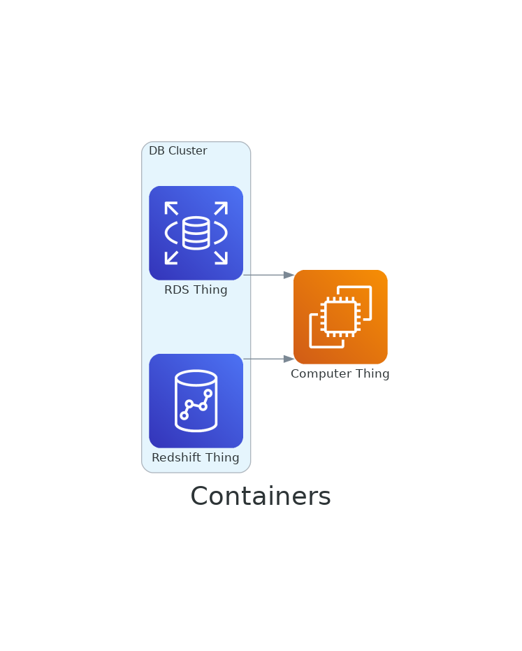

## Introduction

I recently learned about [diagrams](https://diagrams.mingrammer.com/) which allows the user to draw cloud system architecture diagrams using python code.  Pretty neat!  Let's see how it works.

Let's import all the stuff we'll need, then do a little example.


```python
from diagrams import Cluster, Diagram, Edge
from diagrams.aws.compute import EC2
from diagrams.aws.database import RDS, Redshift
from diagrams.aws.network import ELB

# Standard graphviz graph attibutes to pass.
GRAPH_ATTRS = {"fontsize": "28", "bgcolor": "transparent"}
```


```python
# Create the diagram via the following context:
FILENAME_1 = "../assets/images/arch_diagrams/1"
with Diagram("Name of Service", show=False, filename=FILENAME_1, graph_attr=GRAPH_ATTRS):
    elb_1 = ELB("The Label")
    ec2_1 = EC2("Another Label")
    rds_1 = RDS("User Label")

    elb_1 >> ec2_1
    ec2_1 >> rds_1
```



Note that you don't _have_ to make these variables.  You can do the same thing with 

```python
    ELB("The Label") >> EC2("Another Label") >> RDS("User Label")
```

but I prefer to break it up a bit.  We can also group a number of these together using lists...


```python
FILENAME_2 = "../assets/images/arch_diagrams/2"
with Diagram("Grouped Stuff", show=False, filename=FILENAME_2, graph_attr=GRAPH_ATTRS):
    # All of the things we'll use.
    # Notice we are making a list for the EC2 instances.
    elb_1 = ELB("lb1")
    ec2_list = [EC2(f"worker_{i}") for i in range(5)]
    rds_1 = RDS("Things")

    # Configure the layout...
    elb_1 >> ec2_list >> rds_1
```



Notice this is a bit...tall.  Maybe we'd prefer to have it rotated.  We can do this with the `direction` parameter, like so:


```python
FILENAME_3 = "../assets/images/arch_diagrams/2_tilted"
with Diagram(
    "Grouped Stuff",
    show=False,
    filename=FILENAME_3,
    direction="TB",
    graph_attr=GRAPH_ATTRS,
):
    # All of the things we'll use.
    # Notice we are making a list for the EC2 instances.
    elb_1 = ELB("lb1")
    ec2_list = [EC2(f"worker_{i}") for i in range(5)]
    rds_1 = RDS("Things")

    # Configure the layout...
    elb_1 >> ec2_list >> rds_1
```



We can do a few other cute things.  We can change the color of the edges and put a label on them fairly easily!


```python
FILENAME_4 = "../assets/images/arch_diagrams/4"
with Diagram("Labeled Edges", show=False, filename=FILENAME_4, graph_attr=GRAPH_ATTRS):
    ec2 = EC2("Compute")
    rds = RDS("Store")

    (ec2 >> Edge(label="Put results in", color="red") >> rds)
```



Additionally, we can group together services.  Let's see how!


```python
FILENAME_5 = "../assets/images/arch_diagrams/5"
with Diagram("Containers", show=False, filename=FILENAME_5, graph_attr=GRAPH_ATTRS):
    ec2 = EC2("Computer Thing")

    # Make a cluster (a grouped set of elements).

    # NOTE: Define your grouped services in the cluster.
    # For example, `RDS` and `Redshift` go under the following
    # with statement, NOT in the above code by `EC2`.

    with Cluster("DB Cluster"):
        rds = RDS("RDS Thing")
        rs = Redshift("Redshift Thing")
        db_cluster = [rds, rs]

    db_cluster >> ec2
```



You can also nest clusters and make some pretty diagrams!  Check out the [docs](https://diagrams.mingrammer.com/docs/getting-started/installation) for more stuff that you can do with this package!
